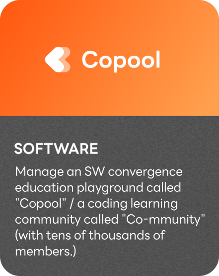
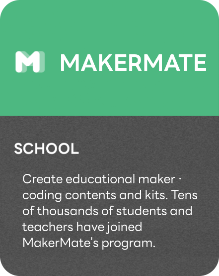
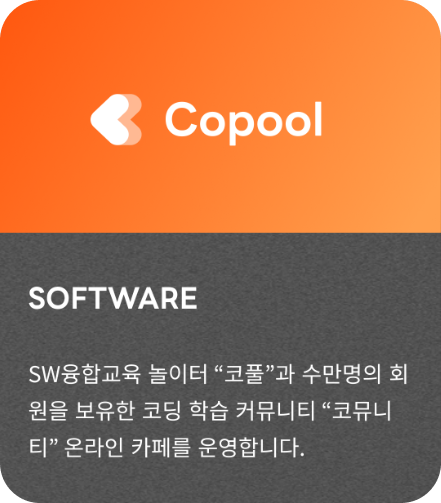

# HuemonelabKit

## Arduino Library for HuemoneLab Arduino Kit
### Version : 4.0.3
<a href="https://huemoneedu.com/">
    

    
    

</a>
last updated By HuemoneLab, April 2024

---------------

The library is used with Arduino kits (Basic Kit, Science Kit, Smart Farm Kit, etc.) produced by Huemonelab, and helps students learn and experience Arduino more fun and easily.

이 라이브러리는 휴몬랩이 제작한 아두이노 키트 (베이직 키트, 사이언스 키트, 스마트팜 키트 등)과 같이 사용되며, 학생들이 아두이노를 더 재미있고 쉽게 배울 수 있도록 도와줍니다.

-----------------
### Contact Us

Email : ask@huemone.com

<a href="https://huemoneedu.com/">
    

    
    

</a>

--------------
### About Our Services

 
<figure class='third'>
    

        
        &nbsp;
        
        &nbsp;
        
    

</figure>
&nbsp;
<figure class='third'>
    

        
        &nbsp;
        
        &nbsp;
        
    

</figure>

